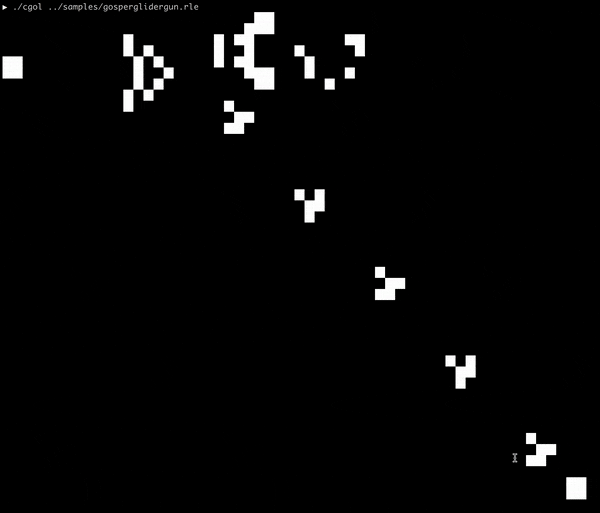
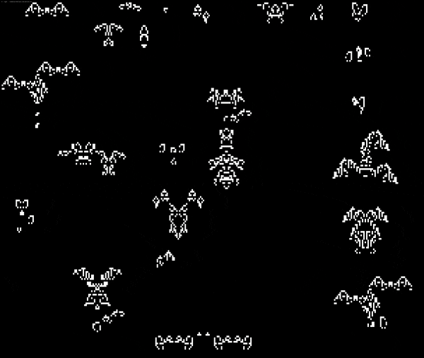
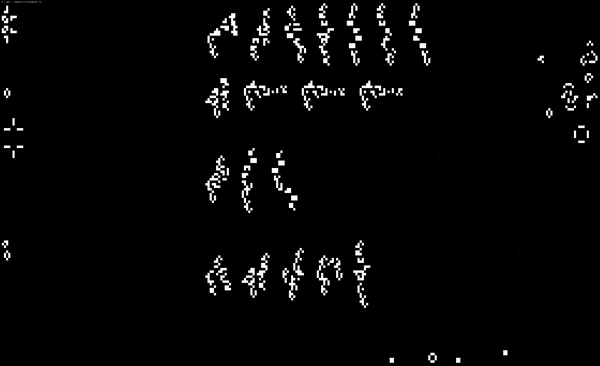

<p align="center">
   
</p>

`cgol` is a modern C++ implementation of Conway's Game of Life.

* **Runs in the terminal** - uses the terminal width/height as the grid size
* Reads from run-length encoding (`.rle`) pattern files (See `samples/`)
* MIT License

## Quick Start

```bash
git clone git@github.com:p-ranav/cgol
cd cgol
mkdir build && cd build
cmake .. && make
```

### Usage

```bash
./cgol <pattern.rle>

# example: ./cgol ../samples/glider.rle
```

## Samples

### Gosper Glider Gun

<p>
   
</p>

### Oscillator Synthesis

<p>
   
</p>

### Spaceships

<p>
   
</p>

### All known c/3 spaceships up to 50 bits

<p>
   
</p>

### Stargate

<p>
   
</p>

### Queen Bee

<p>
   
</p>

### Fermat Prime Calculator

<p>
   
</p>

## Contributing
Contributions are welcome, have a look at the [CONTRIBUTING.md](CONTRIBUTING.md) document for more information.

## License
The project is available under the [MIT](https://opensource.org/licenses/MIT) license.
