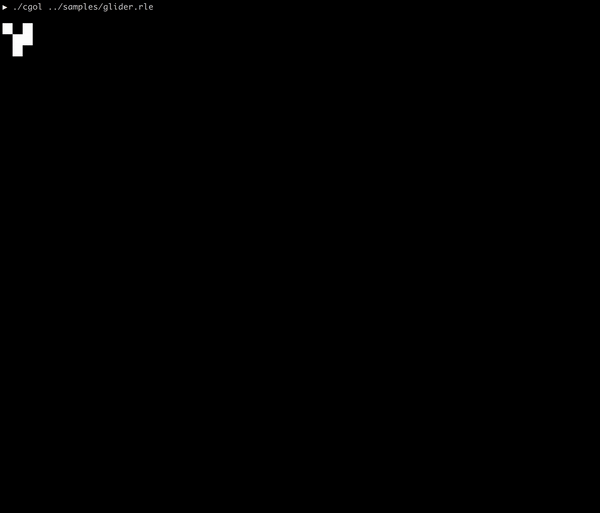

<p align="center">
   
</p>

`cgol` is a modern C++ implementation of Conway's Game of Life.

* Runs in the terminal
* Reads from run-length encoding (`.rle`) pattern files (See `samples/`)
* Uses the terminal width/height as the grid size
* MIT License

## Quick Start

```bash
git clone git@github.com:p-ranav/cgol
cd cgol
cmake ..
make
```

## Samples

### Glider

<p>
   
</p>

### Gosper Glider Gun

<p>
   
</p>

### Oscillator Synthesis

<p>
   
</p>

### Queen Bee

<p>
   
</p>
